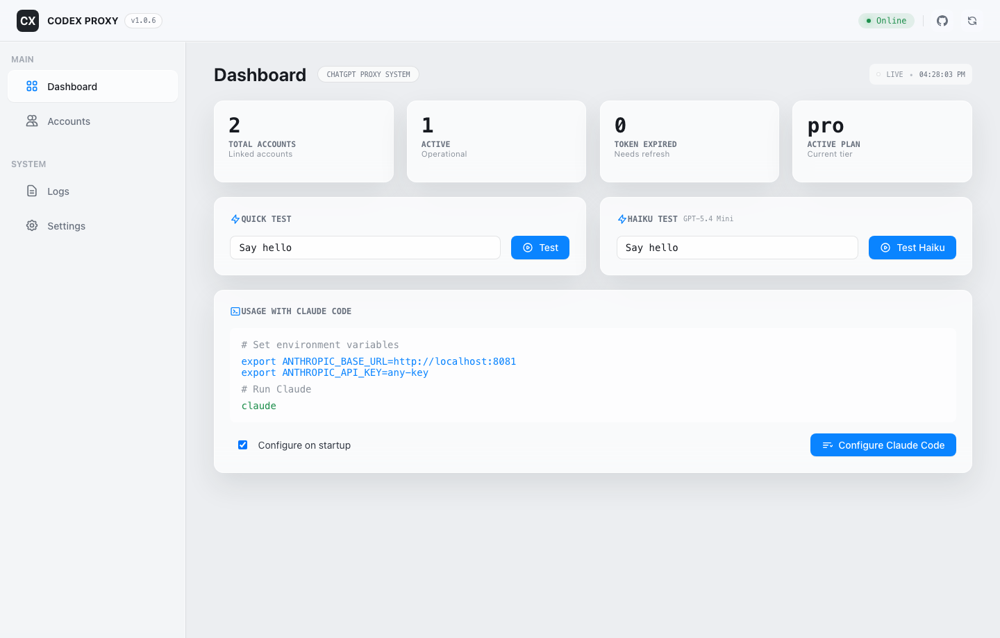

# Codex Claude Proxy



_Current dashboard preview: a real capture of the local Web UI with the macOS-style glass layout._

[](https://choosealicense.com/licenses/mit/)
[](https://nodejs.org/)
[](https://github.com/surajmandalcell/codex-proxy)

> **Use Claude Code CLI with the power of ChatGPT Codex models.**
> A local proxy that translates Anthropic API requests into ChatGPT Codex calls, enabling you to use the `claude` CLI tool with your ChatGPT Free/Plus/Pro subscription.

| Role | Details |
| --- | --- |
| Maintainer | Suraj Mandal |
| GitHub | [surajmandalcell](https://github.com/surajmandalcell) |
| Contact | [surajmandalcell@gmail.com](mailto:surajmandalcell@gmail.com) |
| Package | [@pikoloo/codex-proxy](https://www.npmjs.com/package/@pikoloo/codex-proxy) |

---

## 🚀 Features

- **Seamless Translation**: Translates Anthropic Messages API calls to ChatGPT Codex format.
- **Model Mapping**: maps Claude model aliases to current OpenAI models, with direct GPT model IDs passed through.
- **Personal Account Mode**: Uses the active ChatGPT account by default for local-only personal use, with account switching and auto-refresh.
- **Web Dashboard**: Built-in macOS-style UI (`http://localhost:8081`) for managing accounts, viewing logs, adjusting settings, and testing prompts.
- **Streaming Support**: Full Server-Sent Events (SSE) support for real-time responses.
- **Native Tool Calling**: Supports Claude's tool use capabilities by translating them to Codex function calls.

---

## Security & Privacy

**Is this a malicious proxy? No.**

- **Local Execution**: This server binds to `127.0.0.1` by default.
- **Direct Communication by Default**: Claude and GPT model requests connect directly to OpenAI/ChatGPT endpoints.
- **No Rotation by Default**: Requests use the active account only. Multi-account rotation is disabled unless `CODEX_CLAUDE_PROXY_ENABLE_MULTI_ACCOUNT_ROTATION=true` is set.
- **Third-Party Opt-In**: The explicit `kilo` model route uses Kilo/OpenRouter-backed free models only when `CODEX_CLAUDE_PROXY_ENABLE_KILO=true` is set. Default routing is OpenAI-only.
- **Open Source**: The full source code is available here for you to audit.
- **No Data Collection**: We do not track your prompts, keys, or personal data.

---

## ⚙️ How it works

This tool acts as a "translation layer" between the Claude CLI and ChatGPT's Codex backend.

1.  **Intercept**: Claude Code CLI sends a request to `localhost:8081` (thinking it's Anthropic's API).
2.  **Translate**: The proxy converts the Anthropic-format JSON into the specific payload format required by ChatGPT's internal Codex API.
3.  **Forward**: The request is sent securely to ChatGPT using your own authenticated session.
4.  **Stream**: The response from ChatGPT is converted back into Anthropic's Server-Sent Events (SSE) format and streamed to your terminal.

```
┌──────────────────┐     ┌─────────────────────┐     ┌────────────────────────────┐
│   Claude Code    │────▶│  This Proxy Server  │────▶│  ChatGPT Codex Backend API  │
│ (Anthropic API)  │     │ (Anthropic ⇄ OpenAI)│     │ (codex/responses)           │
└──────────────────┘     └─────────────────────┘     └────────────────────────────┘
```

---

## Installation

Install globally to use the CLI commands anywhere:

```bash
npm install -g @pikoloo/codex-proxy
codex-proxy start
```

Or run the published package without a global install:

```bash
npx @pikoloo/codex-proxy@latest start
```

For release work from this checkout, use `make update` and `make publish`.

The legacy `codex-claude-proxy` command remains available after installing this package.

---

## 🚦 Quick Start

### 1. Start the Proxy

```bash
codex-proxy start
```
The server will start at `http://localhost:8081`.

### 2. Add Your Account

#### **Option A: Web Dashboard (Local Desktop)**

1. Open the dashboard at **[http://localhost:8081](http://localhost:8081)**
2. Go to the **Accounts** tab
3. Click **Add Account** and login with your ChatGPT account

#### **Option B: CLI (Desktop or Headless/VM)**

```bash
# Desktop (opens browser)
codex-proxy accounts add

# Headless/VM server (manual code input)
codex-proxy accounts add --no-browser
```

For **headless/VM servers** without a browser:
1. Run the command with `--no-browser`
2. It will print a URL - copy and open it on a device with a browser
3. Complete login on that device
4. After redirect, copy the callback URL (or just the code)
5. Paste it back in the terminal

### 3. Configure Claude Code
   Run this command to automatically configure your `claude` CLI to use the proxy:
   ```bash
   curl -X POST http://localhost:8081/claude/config/proxy
   ```

   *Alternatively, set the environment variables manually:*
   ```bash
   export ANTHROPIC_BASE_URL=http://localhost:8081
   export ANTHROPIC_API_KEY=dummy-key # The key is ignored but required by the CLI
   ```

4. **Run Claude**:
   ```bash
   claude
   ```

---

## 🧠 Model Mapping

The proxy automatically maps Claude model names to current OpenAI backend models. Direct `gpt-*` model IDs are passed through.

| Requested Model ID | Upstream Model | Auth Required | Description |
| :--- | :--- | :---: | :--- |
| `claude-sonnet-4-5` | `gpt-5.5` | ✅ | Current default high-intelligence model |
| `claude-opus-4-5` | `gpt-5.5` | ✅ | Current default high-intelligence model |
| `claude-haiku-4` | `gpt-5.4-mini` | ✅ | OpenAI small-model lane |
| `codex` | `gpt-5.3-codex` | ✅ | Latest Codex-optimized model |
| `kilo` | Selected Kilo target | ❌ | Explicit third-party free-model route, disabled unless `CODEX_CLAUDE_PROXY_ENABLE_KILO=true` |

---

## 🛠️ Configuration & API

### Web Dashboard

The dashboard uses a clean desktop split-view layout with a compact toolbar, native-feeling glass surfaces, account management, live logs, settings, and prompt test panels. The screenshot at the top of this README is captured from the actual local app.

Visit `http://localhost:8081` to:
- **Manage Accounts**: Add, remove, or switch active ChatGPT accounts.
- **Personal Mode**: Requests use the active account only unless multi-account rotation is explicitly enabled by environment variable.
- **View Logs**: See real-time request/response logs for debugging.
- **Test Models**: Run quick tests against the configured models.

### API Endpoints
- `GET /health`: Check server status.
- `GET /accounts`: List configured accounts.
- `POST /v1/messages`: Anthropic-compatible chat completion endpoint.

See [API Documentation](./docs/API.md) for full details.

---

## 🤝 Contributing

Contributions are welcome! Please feel free to submit a Pull Request.

1. Fork the repository
2. Create your feature branch (`git checkout -b feature/AmazingFeature`)
3. Commit your changes (`git commit -m 'Add some AmazingFeature'`)
4. Push to the branch (`git push origin feature/AmazingFeature`)
5. Open a Pull Request

---

## 📄 License
This project is licensed under the MIT License - see the [LICENSE](LICENSE) file for details.

## ⚠️ Disclaimer
This project is an independent open-source tool and is not affiliated with, endorsed by, or sponsored by Anthropic or OpenAI. "Claude" is a trademark of Anthropic PBC. "ChatGPT" and "Codex" are trademarks of OpenAI. Use responsibly and in accordance with applicable Terms of Service.

---

<div align="center">
  <p>If you find this project useful, please give it a star! ⭐️</p>
  <a href="https://github.com/surajmandalcell/codex-proxy">
    
  </a>
</div>
